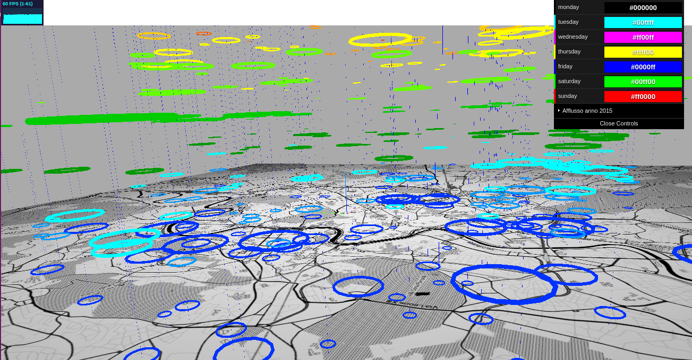
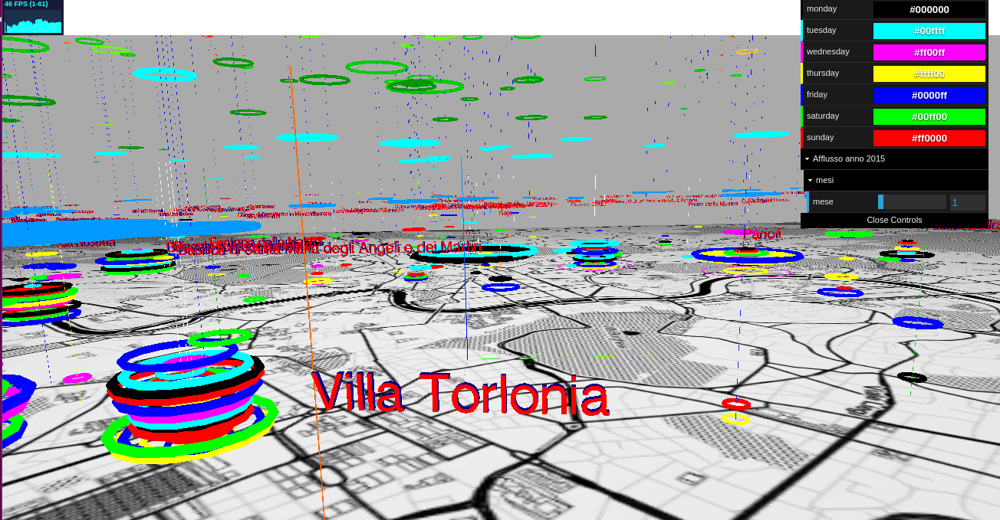
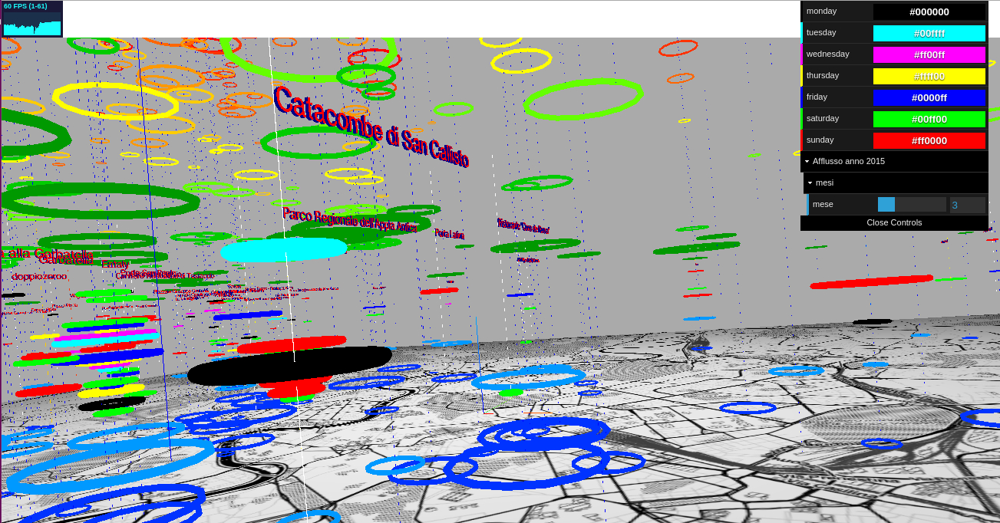

#Concentrazione delle Persone nel 2015 a Roma
---------------------------------------------------

## Introduzione
---------------
Il progetto presentato si pone l'obiettivo di visualizzare la congestione delle persone nei vari luoghi di interesse durante tutto il corso del'anno 2015. La rappresentazione è stata creata in 3D utilizzando Three.js. Il progetto mostra una mappa attuale di Roma, dei segmenti perpendicolari alla mappa che servono a puntare i vari luoghi per una più chiara visualizzazione ed infine 12 differenti livelli, uno per ogni mese, di colori differenti per distinguerli tra di loro (non presenti nella legenda) e distanziati in altezza.
Questi livelli sono formati da vari toroidi di raggio differente in base al numero delle persone che hanno congestionato quel luogo, questi dati sono stati recuperati dalle reti sociali Instagram e Foursquare nell'arco dell'anno 2015.
Si trova inoltre sulla parte alta destra un controller con il quale si può interagire per selezionare un certo mese ed espandere quest'ultimo per giorni, così da avere una visione più granulare dei dati, per ottenere informazioni altrimenti non comprensibili da altre visualizzazioni.
E' presente anche una legenda, rappresentante i colori dei singoli giorni distinti, per una più chiara visione dei dati.

## Dataset
---------------
Il nostro DataSet principalmente ci offre un insieme di dati che riguardano punti di interessi vari (es bar,ristorante,ecc) e per ognuno di essi viene fatto corrispondere un set di foto che i diversi utenti hanno pubblicato su Instagram in quel punto di interesse. Tutti questi dati sono stati processati per ottenere delle strutture più snelle e chiare, utili per la visulizzazione che volevamo ottenere. Questa fase è stata fondamentale, visto che i dati dovevano essere poi processati in three.js il più velocemente possibile, così da diminuire il tempo di attesa dell'utente nel caricamento di tutti i dati. Sono così state studiate e create delle strutture dati per migliorare l'efficienza e la velocità del programma. Sono stati usati infine due file contenenti uno i dati con granularità mensile, mentre l'altro con granularità giornaliera.

## Implementazione
---------------
Nell'implementazione vengono prima definiti gli elementi di scena e settati i fattori di luce, luminosità e camera. Inizia poi la fase di processamento per mesi, che vengono visualizzati all'inizio della scena; si accede così al file contenente tutte le informazioni precedentemente create e si crea un oggetto "padre" per ogni mese; ad ognuno di questi oggetti vengono attaccati tanti figli quanti sono i luoghi visitati in quel mese, ognuno con una certa posizione definita dalla latitudine e longitudine del posto e con una certa grandezza, definita usando una funzione logaritmica, così da far comunque vedere i luoghi con un count piccolo, e non far apparire troppo grandi i luoghi con un count più alto. Tutti questi oggetti vengono poi attaccati alla scena in posizioni diverse così per meglio distinguerli.

------------------

Viene poi configurato un controller che permette di decidere quale tra i mesi presenti vogliamo espandere per meglio visualizzare i dati; quando viene selezionato un mese, il programma rimuove dalla scena l'oggerro "padre" per quel mese e ne inserisce uno nuovo, al quale vengono aggiunti tutti i luoghi suddivisi per giorni in quel mese. I vari colori e l'altezza differenziano i vari giorni tra di loro per ogni singlolo posto, inoltre la grandezza dei toroidi identifica la differenza dei count per ogni giorno. Oltre a questo, sopra ogni luogo viene creata una scritta in 3D con il nome del luogo, per meglio riconoscerlo; infine ogni segmento verticale che identifica il luogo nella mappa, cambia colore, rispetto a quello univoco che si ha rispetto alla visualizzazione per mesi, così da distinguere i luoghi del mese selezionato da quello degli altri mesi, se i luoghi sono troppo vicini. Sono state aggiunte anche delle piccole particolarità per una migliore navigazione e visualizzazione delle informazioni: per prima cosa, selezionando i mesi alti la camera cambia puntamento e guarda l'oggetto appena aggiunto così che ci si può focalizzare sul mese selezionato.Inoltre, altra cosa che viene modificata è la posizione del piano con la mappa, che si alza in base al mese scelto, così che si riesce a capire la posizione dei luoghi anche per i mesi che stanno più in alto nella rappresentazione.
Quando da un mese, poi, se ne seleziona un altro, grazie alla memoria del mese precedentemente aperto, si ripristina la visualizzazione "per mese" di quello prima espanso, e si espande quella "per giorno" del mese scelto.

------------------

------------------

## Conclusioni
---------------
Il sistema così sviluppato, ci permette una visualizzazione dei dati su più livelli di granularità, così da poter confrontare i dati sotto più punti di vista; grazie poi all'espansione "per giorni" è stato possibile notare informazioni che altrimenti non avremmo potuto notare: per esempio luoghi che sono vicini spazialmente ed hanno per alcuni giorni un afflusso di un certo tipo, ci possono far pensare ad un movimento di un flusso di persone da una parte ad un'altra; inoltre visualizzare i giorni della settimana suddivisi per colori, ci ha permesso invece di notare luoghi in cui l'afflusso avviene solo in certi giorni, come magari il sabato o la domenica, ed altri in cui l'afflusso è costante tutti i giorni.

[Demo](http://52.40.120.58/ProjectInfiVis/ProjectThreejs.html)
